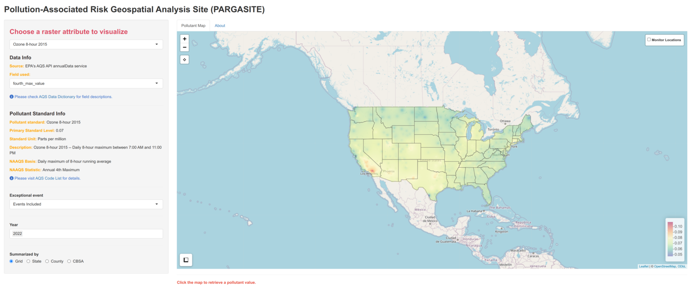
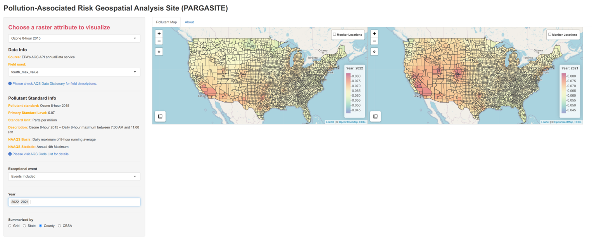

# PARGASITE

Pollution-Associated Risk Geospatial Analysis STIE (PARGASITE) is an R package
to estimate and visualize major pollutant levels (CO, NO2, SO2, Ozone, PM2.5 and
PM10) covering the conterminous United States at user-defined time ranges. It
provides a function that automatically retrieves pollutant data via the
Environmental Protection Agency’s (EPA) Air Quality System (AQS) API service,
filters the data by exceptional event (e.g., wildfire) status, performs spatial
interpolations, and summarizes pollutant concentrations by geographic boundaries
including State, County, and Core-Based Statistical Area (CBSA). It also offers
a Shiny application to interactively visualize pollutant levels and to easily
check the air quality status of a given location over time relative to the level
of the National Ambient Air Quality Standards (NAAQS).

The PARGASITE package has been re-designed due to the deprecation of the rgdal
package, and thus, it is not compatible with the previous version. Please check
the v1 branch if you want to use the old interface.

# Getting Started

## Installation

In R session, please type

```{r setup}
## Install from CRAN
install.packages("pargasite")

## Load pargasite pacakge
library(pargasite)
```

## Pollutant data

The package helps users retrieve pollutant data from EPA's AQS database and
estimate pollutant levels covering the conterminous US using `create
pargasite_data` function.

Since it downloads pollutant data using [AQS
API](https://aqs.epa.gov/aqsweb/documents/data_api.html), users need to register
API service first. Please check the raqs package to create an account and set up
email and key for the current R session.

```{r api service}
library(raqs)

## Please use your eamil address to create an account
## A verification email wille be sent to the eamil account speficied.
aqs_signup('youremail@address.com')

## Set API info for the current session
set_aqs_user(email = "youremail@address.com", key = "your_api_key")
```

The following command create a raster-based data cube for ozone concentrations
through 2021 to 2022. Briefly, the function downloads and processes AQS API data
based on pollutant standards, creates regular grid covering the conterminous US,
and performs spatial interpolation on the grid. For spatial interpolation, the
AQS data is projected to EPSG:6350 (NAD83 CONUS Albers).

```{r create pargasite data}
## Ozone concentrations based on 20km x 20km grid over the conterminous US
ozone20km <- create_pargasite_data(
  pollutant = "Ozone", event_filter = "Events Included", year = 2021:2022,
  cell_size = 20000
)
```

`event_filter` determines whether data measured during exceptional events (e.g.,
wildfire) are included in the result. Exceptional event means that it affects
air quality, but the local agency has no control over. 'Events Included' will
include the data from exceptional events. 'Events Excluded' excluded data from
exceptional events. 'Concurred Events Excluded' exclude data from events but
only EPA concurred exclusions are removed from the result. Please check [AQS
Data Dictionary](https://aqs.epa.gov/aqsweb/documents/AQS_Data_Dictionary.html)
for the details.

You could also create other pollutant data cubes and combine them.

```{r combine data cubes}
## CO concentrations
co20km <- create_pargasite_data(
  pollutant = "CO", event_filter = "Events Included", year = 2021:2022,
  cell_size = 20000
)

## Combine pollutant data cubes
combined <- c(ozone20km, co20km)
```

## Shiny application

To visualize a pollutant data cube, launch the shiny app with

```{r, launch shiny app}
run_pargasite(combined, summarize_by = c("state", "county", "cbsa"))
```

The system's default web browser will be launched automatically after the app is
started.

On the left panel, a user can choose a pollutant attribute, event filter, and
year to visualize. Relevant pollutant standard information will be provided. A
pollutant value will be printed at bottom left in response to a mouse click
event for a specific location.



We are often interested in pollutant levels by geographic boundaries. A user can
display summarized values using the "summarize_by" app menu, which provides
areal mean either by State, County, or Core Based Statistical Area (CBSA).


In addition, clicking "Show Monitor Locations" will returns all monitors operated
in a given year.



