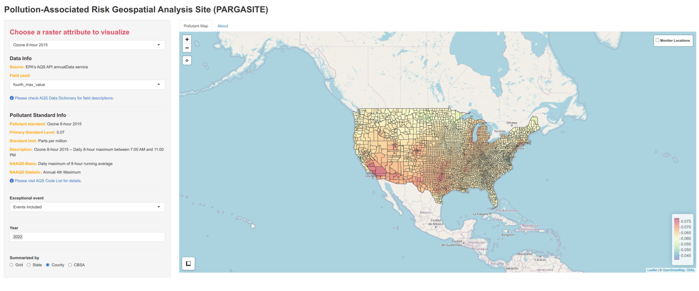

```{r, include = FALSE}
knitr::opts_chunk$set(
  collapse = TRUE,
  comment = "#>",
  eval = FALSE
)
```

The pargasite package offers tools to estimate and visualize levels of major
pollutants (CO, NO2, SO2, Ozone, PM2.5, and PM10) across the conterminous United
States for user-defined time ranges. It provides functions to retrieve pollutant
data from the Environmental Protection Agency’s (EPA) Air Quality System (AQS)
API service for interactive visualization through a Shiny application, allowing
users to explore pollutant levels for a given location over time relative to the
National Ambient Air Quality Standards (NAAQS).

## Installation

In R session, please type

```{r setup}
## Install from CRAN
install.packages("pargasite")

## Load pargasite pacakge
library(pargasite)
```

## Pollutant data

The package helps users retrieve pollutant data from EPA's AQS database and
estimate pollutant levels covering the conterminous US using `create
pargasite_data` function.

Since it downloads pollutant data using [AQS
API](https://aqs.epa.gov/aqsweb/documents/data_api.html), users need to register
API service first. Please check the raqs package to create an account and set up
email and key for the current R session.

```{r api service}
if (!requireNamespace("raqs", quietly = TRUE)) {
  install.packages("raqs")
}
library(raqs)

## Please use your eamil address to create an account
## A verification email wille be sent to the eamil account speficied.
aqs_signup('youremail@address.com')

## Set API info for the current session
set_aqs_user(email = "youremail@address.com", key = "your_api_key")
```

The following command create a raster-based data cube for ozone concentrations
through 2021 to 2022. Briefly, the function downloads and processes AQS API data
based on pollutant standards, creates regular grid covering the conterminous US,
and performs spatial interpolation on the grid. For spatial interpolation, the
AQS data is projected to EPSG:6350 (NAD83 CONUS Albers).

```{r create pargasite data}
## Ozone concentrations based on 20km x 20km grid over the conterminous US
ozone20km <- create_pargasite_data(
  pollutant = "Ozone", event_filter = "Events Included", year = 2021:2022,
  cell_size = 20000
)
```

`event_filter` determines whether data measured during exceptional events (e.g.,
wildfire) are included in the result. Exceptional event means that it affects
air quality, but the local agency has no control over. 'Events Included' will
include the data from exceptional events. 'Events Excluded' excluded data from
exceptional events. 'Concurred Events Excluded' exclude data from events but
only EPA concurred exclusions are removed from the result. Please check [AQS
Data Dictionary](https://aqs.epa.gov/aqsweb/documents/AQS_Data_Dictionary.html)
for the details.

You could also create other pollutant data cubes and combine them.

```{r combine data cubes}
## CO concentrations
co20km <- create_pargasite_data(
  pollutant = "CO", event_filter = "Events Included", year = 2021:2022,
  cell_size = 20000
)

## Combine pollutant data cubes
combined <- c(ozone20km, co20km)
```

## Shiny application

To visualize a pollutant data cube, launch the shiny app with

```{r, launch shiny app}
run_pargasite(combined)
```

The system's default web browser will be launched automatically after the app is
started.

The left panel allows users to select a pollutant attribute, filter events, and
choose years for visualization. Relevant pollutant standard information will
also be provided.

{width=100%}

<br/>

Users can summarize data by geographical area using the "Summarized By" menu in
the app. This menu allows selection of areal means for states, counties, or Core
Based Statistical Areas (CBSAs).

{width=100%}

<br/>

To view historical pollutant level trends, select multiple years from the app
menu.

<br/>

{width=100%}
